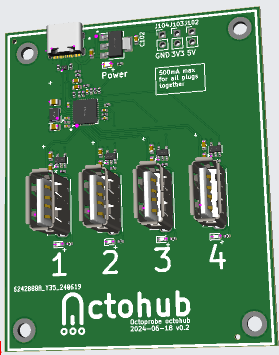

# octohub

A simple usb 2.0 hub with focus on per port power switching.

Work in progress.

## Features - Hardware

* ~USD 4 when ordering 30 pieces. Fully assembled at JLCPCB.

* Kicad. Production files ready to upload to JLCPCB.

* Power control for each plug using (uhubctl)[https://github.com/mvp/uhubctl].

* **NO** manual power buttons. Many commercial hubs have buttons. If accidentely pressed, usb switching is disabled.

* Power LEDs which are visible from different angles. Many commercial switchs have LEDs, but not well visible.

* Plug numbering. Many commercial switches do not number the plugs and there is very little space left to add stickers.

## Features - Electronics

USB2 only. This makes `uhubctl` much faster.

Bus powered. Less cables is better.

USB descripter `self-powered`. This is against the USB spec. This is required as a RP2 requests 500mA. The USB 2.0 spec allows a bus-powered device to use max 100mA. The current measureed on the RP2 is only 25mA.

Over current protection. However, no over current feedback to USB.

If a device requires USB3, it is still possible to use a commercial hub.

## Current state of v0.2:

[Schematics](octohub_kicad_v0.2/production_v0.2/schematics.pdf)

